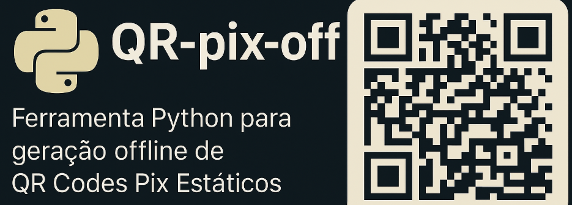
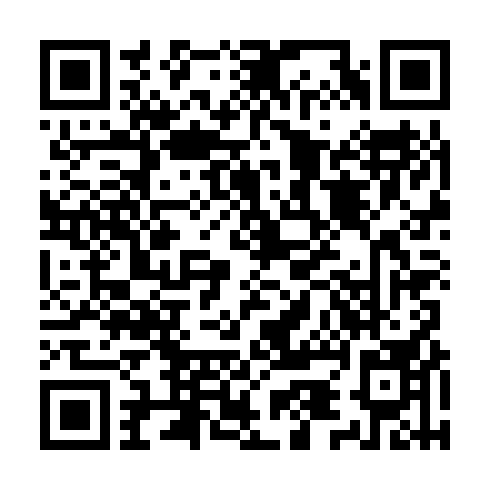

# QR-pix-off

**QR-pix-off** é uma ferramenta Python minimalista para a **geração offline de QR Codes Pix Estáticos** e seus respectivos *payloads* "Copia e Cola". 

Ideal para desenvolvedores e pequenas aplicações que necessitam criar QR Codes Pix com valor fixo ou opcionalmente livre, sem a necessidade de integração com APIs de Provedores de Serviço de Pagamento (PSPs) para cada transação.

## ✨ Recursos

*   **Geração de Payload Pix:** Constrói a string completa do Pix Copia e Cola, aderindo estritamente ao padrão BR Code (EMV® QR Code) do Banco Central do Brasil.
*   **QR Code Estático:** Foco em QR Codes que podem ser reutilizados para múltiplas transações ou doações.
*   **Identificador de Transação (TXID):** Suporte opcional para incluir um TXID para conciliação interna, com a opção padrão de '***' (sem identificador específico).
*   **Normalização de Dados:** Trata automaticamente o nome e a cidade do recebedor, removendo acentos e formatando para o padrão ASCII requerido.
*   **Checksum CRC16:** Garante a integridade do payload gerado, crucial para a validação por aplicativos bancários.
*   **Saída em Imagem:** Gera uma imagem `.png` do QR Code para fácil utilização.

## 🚀 Instalação

Para usar o QR-pix-off, você precisará ter o Python 3 instalado. Em seguida, instale a biblioteca `qrcode` via pip:

```bash
pip install qrcode
```

## 💡 Como Usar

O projeto é projetado para ser simples e direto. Você pode importar a função `gerar_qrcode_pix` e utilizá-la em seu código:

```python
#!/usr/bin/env python3

from qr_pix_off import gerar_qrcode_pix # Assumindo que o código está em qr_pix_off.py

# Exemplo básico de uso:
if __name__ == "__main__":
    gerar_qrcode_pix(
        chave="sua.chave.pix@exemplo.com", # Pode ser CPF, CNPJ, telefone, e-mail ou EVP
        nome="Nome Completo do Recebedor",  # Até 25 caracteres, sem acentos
        cidade="Cidade do Recebedor",       # Até 15 caracteres, sem acentos
        valor=123.45,                       # Valor da transação (ex: 1.55, 123.45)
        txid="PEDIDO123",                   # Opcional: ID da transação (até 25 caracteres). Padrão é "***"
        arquivo="meu_pix_estatico.png"      # Opcional: Nome do arquivo de saída
    )
```

**Parâmetros da função `gerar_qrcode_pix`:**

*   `chave` (obrigatório): A chave Pix do recebedor (CPF, CNPJ, telefone, e-mail ou EVP).
*   `nome` (obrigatório): Nome completo do recebedor. Será normalizado para até 25 caracteres ASCII e em maiúsculas.
*   `cidade` (obrigatório): Cidade do recebedor. Será normalizada para até 15 caracteres ASCII e em maiúsculas.
*   `valor` (obrigatório): O valor da transação. Será formatado com duas casas decimais. Para um QR Code com valor em aberto (onde o pagador digita o valor), o campo `54` (valor) deve ser omitido do payload. **Observação:** Esta implementação específica *sempre* inclui o valor. Se precisar de um QR com valor em aberto, a lógica em `payload_pix` precisaria ser ajustada para tornar o campo `54` opcional.
*   `txid` (opcional): Um identificador de transação personalizado (até 25 caracteres alfanuméricos). O padrão é `***`.
*   `arquivo` (opcional): O nome do arquivo `.png` onde o QR Code será salvo. Padrão é `pix_qrcode.png`.


### Exemplo de output esperado.

```bash
Payload Pix Copia e Cola: 00020126440014BR.GOV.BCB.PIX0122alguma.chave.pix@gmail52040000530398654042.995802BR5913LUIZ DA SILVA6007GOIANIA62070503***630492DC
QR Code salvo como pix_qrcode.png
```

### Exmplo do qrcode gerado.

<p align="center">
 
</p>

> Esse exemplo de QRcode acima possibilita uma cobança de `2` reais e `99` centavos para a chave pix `alguma.chave.pix@gmail` em nome de `Luiz da Silva` em `Goiânia` via pix.

## ⚙️ Como Funciona Internamente

O **QR-pix-off** constrói o *payload* Pix seguindo a rigorosa especificação **TLV** (Tag-Length-Value), onde cada peça de informação é empacotada com um identificador (Tag) e seu comprimento (Length). Campos como `00` (indicador de formato), `26` (informações da conta do recebedor), `52` (código de categoria), `53` (moeda), `54` (valor), `58` (país), `59` (nome), `60` (cidade) e `62` (dados adicionais, incluindo TXID) são cuidadosamente montados na ordem correta.

O valor da chave Pix (`subcampo 01` dentro do `ID 26`) é utilizado para identificar o recebedor, e o sistema Pix do Banco Central (`DICT`) é responsável por mapear essa chave aos dados bancários internos.

Finalmente, um **CRC16-CCITT-FALSE** é calculado sobre todo o *payload* e anexado no final (`ID 63`), garantindo a integridade dos dados e permitindo que os aplicativos bancários detectem qualquer corrupção no código.
